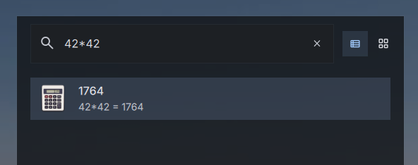

# Calculator Plugin for DMS Launcher


[](https://plugins.danklinux.com/calculator.html)

A launcher plugin that evaluates mathematical expressions and copies results to the clipboard.



## Features

- **Real-time calculation**: Type mathematical expressions directly in the launcher
- **Default prefix**: Uses `=` as the default trigger prefix (configurable)
- **Safe evaluation**: Only allows mathematical operations, preventing code injection
- **Clipboard integration**: Press Enter to copy the result to clipboard
- **Multiple operations**: Supports +, -, *, /, ^, %, and parentheses

## Installation

### Via DMS

```bash
dms plugins install Calculator
```

### Via DMS GUI
- Mod + ,
- Go to Plugins Tab
- Choose Browse
- Enable third party
- install Calculator

### Manually

```
cd ~/.config/DankMaterialShell/plugins
git clone https://github.com/rochacbruno/DankCalculator Calculator
```

1. Open DMS Settings (Ctrl+,)
2. Navigate to Plugins tab
3. Click "Scan for Plugins"
4. Enable the "Calculator" plugin with the toggle switch

## Usage

### With Default Settings (= Prefix)

1. Open the launcher (Ctrl+Space)
2. Type the `=` prefix followed by a mathematical expression: `= 3 + 3`
3. The result (`6`) appears as a launcher item
4. Press Enter to copy the result to clipboard

### Customizing the Trigger

You can configure a different trigger prefix or disable it entirely in the settings:

1. Open Settings → Plugins → Calculator
2. Change the trigger to a custom value (e.g., `calc`, `c`, `math`)
3. Or check "No trigger (always active)" to remove the prefix requirement
4. In the launcher, type your configured trigger: `calc 3 + 3` or just `3 + 3` (if no trigger)
5. Press Enter to copy the result

### Adding a keybinding (niri)

```kdl
binds {
      Mod+Shift+C hotkey-overlay-title="Calculator" {
        spawn "dms" "ipc" "call" "spotlight" "openQuery" "=";
    }
}
```

## Supported Operations

- **Addition**: `= 3 + 3` → `6`
- **Subtraction**: `= 10 - 5` → `5`
- **Multiplication**: `= 4 * 7` → `28`
- **Division**: `= 20 / 4` → `5`
- **Exponentiation**: `= 2 ^ 8` → `256`
- **Modulo**: `= 17 % 5` → `2`
- **Parentheses**: `= (5 + 3) * 2` → `16`
- **Decimals**: `= 3.14 * 2` → `6.28`
- **Complex**: `= (10 + 5) * 2 - 3 / 3` → `29`

## Examples

| Expression | Result |
|------------|--------|
| `= 3 + 3` | `6` |
| `= 100 / 4` | `25` |
| `= 2 ^ 10` | `1024` |
| `= (5 + 3) * 2` | `16` |
| `= 3.14159 * 2` | `6.28318` |
| `= 16 ^ 0.5` | `4` (square root) |

## Security

The calculator uses safe expression evaluation:
- Only allows numbers, operators (+, -, *, /, ^, %), parentheses, and dots
- Rejects any expressions with letters or special characters (except operators)
- Prevents code injection by validating input before evaluation

## Files

- `plugin.json` - Plugin manifest
- `CalculatorLauncher.qml` - Main launcher component
- `CalculatorSettings.qml` - Settings UI
- `calculator.js` - Safe expression evaluation logic
- `README.md` - This file

## Configuration

Settings are stored in `~/.config/DankMaterialShell/plugin_settings.json` under the `calculator` plugin key:

```json
{
  "pluginSettings": {
    "calculator": {
      "trigger": "=",
      "noTrigger": false
    }
  }
}
```

## Troubleshooting

**Calculator items don't appear:**
- Make sure the plugin is enabled in Settings → Plugins
- Check that you're typing a valid mathematical expression
- Try disabling "No trigger" and setting a specific trigger

**Result shows wrong value:**
- JavaScript has floating-point precision limitations
- Very large or very small numbers may use scientific notation

**Copy to clipboard doesn't work:**
- Make sure your system clipboard is accessible
- Check console for error messages

## Version

1.0.0

## Author

Bruno Cesar Rocha 

## License

Same as DankMaterialShell
